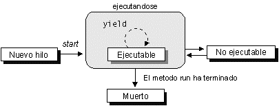

# Hilos

Un hilo es un flujo de control dentro de un programa. Creando varios hilos podremos realizar varias tareas simultáneamente. Cada hilo tendrá sólo un contexto de ejecución \(contador de programa, pila de ejecución\). Es decir, a diferencia de los procesos UNIX, no tienen su propio espacio de memoria sino que acceden todos al mismo espacio de memoria común, por lo que será importante su sincronización cuando tengamos varios hilos accediendo a los mismos objetos.

## Creación de hilos

En Java los hilos están encapsulados en la clase `Thread`. Para crear un hilo tenemos dos posibilidades:

* Heredar de `Thread` redefiniendo el método `run()`.
* Crear una clase que implemente la interfaz `Runnable` que nos obliga a definir el método `run()`.

En ambos casos debemos definir un método `run()` que será el que contenga el código del hilo. Desde dentro de este método podremos llamar a cualquier otro método de cualquier objeto, pero este método `run()` será el método que se invoque cuando iniciemos la ejecución de un hilo. El hilo terminará su ejecución cuando termine de ejecutarse este método `run()`. Para crear nuestro hilo mediante herencia haremos lo siguiente:

```java
public class EjemploHilo extends Thread
{
    public void run()
    {
        // Código del hilo
    }
}
```

Una vez definida la clase de nuestro hilo deberemos instanciarlo y ejecutarlo de la siguiente forma:

```java
Thread t = new EjemploHilo();
t.start();
```

Al llamar al método `start` del hilo, comenzará ejecutarse su método `run`. Crear un hilo heredando de `Thread` tiene el problema de que al no haber herencia múltiple en Java, si heredamos de `Thread` no podremos heredar de ninguna otra clase, y por lo tanto un hilo no podría heredar de ninguna otra clase. Este problema desaparece si utilizamos la interfaz `Runnable` para crear el hilo, ya que una clase puede implementar varios interfaces. Definiremos la clase que contenga el hilo como se muestra a continuación:

```java
public class EjemploHilo implements Runnable
{
    public void run()
    {
        // Código del hilo
    }
}
```

Para instanciar y ejecutar un hilo de este tipo deberemos hacer lo siguiente:

```java
Thread t = new Thread(new EjemploHilo());
t.start();
```

Esto es así debido a que en este caso `EjemploHilo` no deriva de una clase `Thread`, por lo que no se puede considerar un hilo, lo único que estamos haciendo implementando la interfaz es asegurar que vamos a tener definido el método `run()`. Con esto lo que haremos será proporcionar esta clase al constructor de la clase `Thread`, para que el objeto `Thread` que creemos llame al método `run()` de la clase que hemos definido al iniciarse la ejecución del hilo, ya que implementando la interfaz le aseguramos que esta función existe.

## Ciclo de vida y prioridades

Un hilo pasará por varios estados durante su ciclo de vida.

```java
Thread t = new Thread(this);
```

Una vez se ha instanciado el objeto del hilo, diremos que está en estado de  _Nuevo hilo_.

```java
t.start();
```

Cuando invoquemos su método `start()` el hilo pasará a ser un hilo _vivo_, comenzándose a ejecutar su método `run()`. Una vez haya salido de este método pasará a ser un hilo _muerto_.

La única forma de parar un hilo es hacer que salga del método `run()` de forma natural. Podremos conseguir esto haciendo que se cumpla una condición de salida de `run()` \(lógicamente, la condición que se nos ocurra dependerá del tipo de programa que estemos haciendo\). Las funciones para parar, pausar y reanudar hilos están desaprobadas en las versiones actuales de Java.

Mientras el hilo esté _vivo_, podrá encontrarse en dos estados:  _Ejecutable_ y  _No ejecutable_. El hilo pasará de  _Ejecutable_ a  _No ejecutable_ en los siguientes casos:

* Cuando se encuentre dormido por haberse llamado al método `sleep()`, permanecerá  _No ejecutable_ hasta haber transcurrido el número de milisegundos especificados.
* Cuando se encuentre bloqueado en una llamada al método `wait()` esperando que otro hilo lo desbloquee llamando a _notify\(\)_ o _notifyAll\(\)_. Veremos cómo utilizar estos métodos más adelante.
* Cuando se encuentre bloqueado en una petición de E/S, hasta que se complete la operación de E/S.



Lo único que podremos saber es si un hilo se encuentra vivo o no, llamando a su método `isAlive()`.

### Prioridades de los hilos

Además, una propiedad importante de los hilos será su prioridad. Mientras el hilo se encuentre vivo, el _scheduler_ de la máquina virtual Java le asignará o lo sacará de la CPU, coordinando así el uso de la CPU por parte de todos los hilos activos basándose en su prioridad. Se puede forzar la salida de un hilo de la CPU llamando a su método `yield()`. También se sacará un hilo de la CPU cuando un hilo de mayor prioridad se haga _Ejecutable_, o cuando el tiempo que se le haya asignado expire.&lt;/p&gt; Para cambiar la prioridad de un hilo se utiliza el método `setPriority()`, al que deberemos proporcionar un valor de prioridad entre `MIN_PRIORITY` y `MAX_PRIORITY` \(tenéis constantes de prioridad disponibles dentro de la clase `Thread`, consultad el API de Java para ver qué valores de constantes hay\).

### Interrupción de un hilo

Los objetos de clase `Thread` cuentan con un método `.interrupt()` que permite al hilo ser interrumpido. En realidad la interrupción simplemente cambia un flag del hilo para marcar que ha de ser interrumpido, pero cada hilo debe estar programado para soportar su propia interrupción.

Si el hilo invoca un método que lance la excepción `InterruptedException`, tal como el método `sleep()`, entonces en este punto del código terminaría la ejecución del método `run()` del hilo. Podemos manejar esta circunstancia con:

```java
for (int i = 0; i < maxI; i++) {
    // Pausar 4 segundos
    try {
        Thread.sleep(4000);
    } catch (InterruptedException e) {
        // El hilo ha sido interrumpido. Vamos a salir de run()
        return;
    }
    System.out.println(algo[i]);
}
```

De esta manera si queda algo que terminar se puede terminar, a pesar de que la ejecución del `sleep()` ha sido interrumpida.

Si nuestro hilo no llama a métodos que lancen `InterruptedException`, entonces debemos ocuparnos de comprobarla periódicamente:

```java
for (int i = 0; i < maxI; i++) {
    trabajoCon(i);
    if (Thread.interrupted()) {
        // El flag de interrupción ha sido activado
        return;
    }
}
```

## Sincronización de hilos

Muchas veces los hilos deberán trabajar de forma coordinada, por lo que es necesario un mecanismo de sincronización entre ellos.

Un primer mecanismo de sincronización es la variable cerrojo incluida en todo objeto `Object`, que permitirá evitar que más de un hilo entre en la sección crítica para un objeto determinado. Los métodos declarados como `synchronized` utilizan el cerrojo del objeto al que pertenecen evitando que más de un hilo entre en ellos al mismo tiempo.

```java
public synchronized void metodo_seccion_critica()
{
    // Código sección crítica
}
```

Todos los métodos `synchronized` de un mismo objeto \(no clase, sino objeto de esa clase\), comparten el mismo cerrojo, y es distinto al cerrojo de otros objetos \(de la misma clase, o de otras\).

También podemos utilizar cualquier otro objeto para la sincronización dentro de nuestro método de la siguiente forma:

```java
synchronized(objeto_con_cerrojo)
{
  // Código sección crítica
}
```

de esta forma sincronizaríamos el código que escribiésemos dentro, con el código `synchronized` del objeto `objeto_con_cerrojo`.

Además podemos hacer que un hilo quede bloqueado a la espera de que otro hilo lo desbloquee cuando suceda un determinado evento. Para bloquear un hilo usaremos la función `wait()`, para lo cual el hilo que llama a esta función debe estar en posesión del monitor, cosa que ocurre dentro de un método `synchronized`, por lo que sólo podremos bloquear a un proceso dentro de estos métodos.

Para desbloquear a los hilos que haya bloqueados se utilizará _notifyAll\(\)_, o bien `notify()` para desbloquear sólo uno de ellos aleatoriamente. Para invocar estos métodos ocurrirá lo mismo, el hilo deberá estar en posesión del monitor.

Cuando un hilo queda bloqueado liberará el cerrojo para que otro hilo pueda entrar en la sección crítica del objeto y desbloquearlo.

Por último, puede ser necesario esperar a que un determinado hilo haya finalizado su tarea para continuar. Esto lo podremos hacer llamando al método `join()` de dicho hilo, que nos bloqueará hasta que el hilo haya finalizado.

### Sincronización reentrante

Se dice que en Java la sincronización es reentrante porque una sección crítica sincronizada puede contener dentro otra sección sincronizada sobre el mismo cerrojo y eso no causa un bloqueo. Por ejemplo el siguiente código funciona sin bloquearse:

```java
    class Reentrant {
        public synchronized void a() {
            b();
            System.out.println(" estoy en a() ");
        }
        public synchronized void b() {
            System.out.println(" estoy en b() ");
        }
    }
```

La salida sería `estoy en b() \n estoy en a()`.

## Bloques vigilados

Los _guarded blocks_ o bloques de código vigilados por determinada condición. Hasta que la condición no se cumpla, no hay que pasar a ejecutar dicho bloque de código.

En este caso lo importante es dejar libre el procesador durante el tiempo de espera. Así, el siguiente código sería ineficiente puesto que estaría ocupando la CPU durante la espera:

```java
public void bloqueVigilado() {
    // No hacerlo así!
    while(!condicion) {} // Se detiene aquí,
    //comprobando iterativamente la condición

    System.out.println("La condición se ha cumplido");
}
```

La forma correcta es invocar el método `wait()`. Así el hilo se bloqueará hasta que otro hilo le haga una llamada a `notify()`. Sin embargo hay que volver a hacer la comprobación de la condición, porque la notificación no significará necesariamente que se haya cumplido la condición. Por eso es necesario tener la llamada a `wait()` dentro de un bucle `while` que comprueba la condición. Si durante la espera se recibe la excepción `InterrputedException`, aún así lo que importa es comprobar, una vez más, la condición.

```java
public synchronized bloqueVigilado() {
    while(!condicion) {
        try {
            wait(); // desocupa la CPU
        } catch (InterruptedException e) {}
    }
    System.out.println("La condición se ha cumplido");
}
```

El bloque es `synchronized` porque las llamadas a `wait()` y a `notify()` siempre deben hacerse desde un bloque de código sincronizado. Operan sobre la variable cerrojo del objeto \(desde distintos hilos\) y por tanto debe hacerse de forma sincronizada.

### Ejemplo: Productor/Consumidor

En los [tutoriales oficiales de Java](http://docs.oracle.com/javase/tutorial/essential/concurrency/index.html) se incluye el siguiente ejemplo clásico del Productor/Consumidor. En este problema hay dos hilos que producen y consumen simultáneamente datos de un mismo buffer o misma variable. El problema es que no se interbloqueen, al tiempo que si el buffer está vacío, el consumidor se quede en espera, y si el buffer está lleno, el productor quede en espera.

En este ejemplo el objeto que se produce y consume es de clase `Drop`, declarada a continuación:

```java
public class Drop {
    // Message sent from producer
    // to consumer.
    private String message;
    // True if consumer should wait
    // for producer to send message,
    // false if producer should wait for
    // consumer to retrieve message.
    private boolean empty = true;

    public synchronized String take() {
        // Wait until message is
        // available.
        while (empty) {
            try {
                wait();
            } catch (InterruptedException e) {}
        }
        // Toggle status.
        empty = true;
        // Notify producer that
        // status has changed.
        notifyAll();
        return message;
    }

    public synchronized void put(String message) {
        // Wait until message has
        // been retrieved.
        while (!empty) {
            try {
                wait();
            } catch (InterruptedException e) {}
        }
        // Toggle status.
        empty = false;
        // Store message.
        this.message = message;
        // Notify consumer that status
        // has changed.
        notifyAll();
    }
}
```

El productor:

```java
import java.util.Random;

public class Producer implements Runnable {
    private Drop drop;

    public Producer(Drop drop) {
        this.drop = drop;
    }

    public void run() {
        String importantInfo[] = {
            "Mares eat oats",
            "Does eat oats",
            "Little lambs eat ivy",
            "A kid will eat ivy too"
        };
        Random random = new Random();

        for (int i = 0;
             i < importantInfo.length;
             i++) {
            drop.put(importantInfo[i]);
            try {
                Thread.sleep(random.nextInt(5000));
            } catch (InterruptedException e) {}
        }
        drop.put("DONE");
    }
}
```

Y el consumidor:

```java
import java.util.Random;

public class Consumer implements Runnable {
    private Drop drop;

    public Consumer(Drop drop) {
        this.drop = drop;
    }

    public void run() {
        Random random = new Random();
        for (String message = drop.take();
             ! message.equals("DONE");
             message = drop.take()) {
            System.out.format("MESSAGE RECEIVED: %s%n", message);
            try {
                Thread.sleep(random.nextInt(5000));
            } catch (InterruptedException e) {}
        }
    }
}
```

Por último, se iniciarían desde un método `main()`:

```java
public class ProducerConsumerExample {
    public static void main(String[] args) {
        Drop drop = new Drop();
        (new Thread(new Producer(drop))).start();
        (new Thread(new Consumer(drop))).start();
    }
}
```

## Tipos de interbloqueos

Los mecanismos de sincronización deben utilizarse de manera conveniente para evitar interbloqueos. Los interbloqueos se clasifican en:

* Deadlock: un hilo A está a la espera de que un hilo B lo desbloquee, al tiempo que este hilo B está también bloqueado a la espera de que A lo desbloquee.
* Livelock: similar al Deadlock, pero en esta situación A responde a una acción de B, y a causa de esta respuesta B responde con una acción a A, y así sucesivamente. Se ocupa toda la CPU produciendo un bloqueo de acciones continuas.
* Stravation \(Inanición\): Un hilo necesita consumir recursos, o bien ocupar CPU, pero se lo impide la existencia de otros hilos "hambrientos" que operan más de la cuenta sobre dichos recursos. Se impide el funcionamiento fluido del hilo o incluso da la impresión de bloqueo.

Detectar los bloqueos es difícil, tanto a priori como a posteriori, y deben ser estudiados cuidadosamente a la hora de diseñar la sincronización entre hilos.

## Mecanismos de alto nivel

Java proporciona algunos mecanismos de más alto nivel para el control y sincronización de hilos.

### La interfaz `Lock`

El "lock" o cerrojo reentrante de Java es fácil de usar pero tiene muchas limitaciones. Por eso el paquete `java.util.concurrent.locks` incluye una serie de utilidades relacionadas con lock. La interfaz más básica de éstas es `Lock`.

```text
    Los objetos cuyas clases implementan la interfaz `Lock` funcionan de manera
    muy similar a los locks implícitos que se utilizan en código sincronizado, de manera que
    sólo un hilo puede poseer el `Lock` al mismo tiempo.


      La ventaja de los objetos `Lock` es que posibilitan rechazar un intento de
      adquirir el cerrojo. El método `tryLock()` rechaza darnos el lock si éste no está
      disponible inmediatamente, o bien tras un tiempo máximo de espera, si se especifica así.
      El método `lockInterruptibly` rechaza darnos el lock si otro hilo envía una
      interrupción antes de que el lock haya sido adquirido.
```

Un ejemplo de sincronización utilizando `Lock` en lugar de `synchronized` sería:

```java
     import java.util.concurrent.locks.Lock;
     import java.util.concurrent.locks.ReentrantLock;

     //...
     Lock l = new ReentrantLock();;
     l.lock();
     try {
         // acceder al recurso protegido por l
     } finally {
         l.unlock();
     }
```

Los objetos `Lock` también dan soporte a un mecanismo de wait/notify a través de objetos `Condition`.

```java
     class BufferLimitado {
       final Lock lock = new ReentrantLock();
       //Dos condiciones para notificar sólo a los hilos
       //que deban hacer put o take, respectivamente
       final Condition notFull  = lock.newCondition();
       final Condition notEmpty = lock.newCondition();

       final Object[] items = new Object[100];
       int putptr, takeptr, count;

       public void put(Object x) throws InterruptedException {
         lock.lock();
         try {
           while (count == items.length)
             notFull.await();
           items[putptr] = x;
           if (++putptr == items.length) putptr = 0;
           ++count;
           notEmpty.signal();
         } finally {
           lock.unlock();
         }
       }

       public Object take() throws InterruptedException {
         lock.lock();
         try {
           while (count == 0)
             notEmpty.await();
           Object x = items[takeptr];
           if (++takeptr == items.length) takeptr = 0;
           --count;
           notFull.signal();
           return x;
         } finally {
           lock.unlock();
         }
       }
     }
```

### Colecciones concurrentes

Java proporciona algunas estructuras con métodos sincronizados, como por ejemplo `Vector`. Más allá de la simple sincronización, Java también proporciona una serie de clases de colecciones que facilitan la concurrencia, y se encuentran en el paquete `java.util.concurrent`. Se pueden clasificar según las interfaces que implementan:

```text
       `BlockingQueue` define una estructura de datos FIFO que bloquea o establece un
       tiempo máximo de espera cuando se intenta añadir elementos a una cola llena o cuando
       se intenta obtener de una cola vacía.


       `ConcurrentMap` es una subinterfaz de `java.util.Map` que define operaciones
       atómicas útiles: por ejemplo eliminar una clave-valor sólo si la clave está presente, o añadir
       una clave valor sólo si la clave no está presente. Al ser operaciones atómicas, no es necesario
       añadir otros mecanismos de sincronización. La implementación concreta es la clase `ConcurrentHashMap`.
```

La interfaz `ConcurrentNavigableMap` es para coincidencias aproximadas, con implementación concreta en la clase `ConcurrentSkipListMap`, que es el análogo concurrente de `TreeMap`.

### Variables atómicas

El paquete `java.util.concurrent.atomic` define clases que soportan operaciones atómicas sobre variables. Las operaciones atómicas son operaciones que no deben ser realizadas por dos hilos simultáneamente. Así, en el siguiente ejemplo de un objeto Contador, en lugar de tener que asegurar la consistencia manualmente:

```java
class ContadorSincronizado {
    private int c = 0;

    public synchronized void increment() {
        c++;
    }

    public synchronized void decrement() {
        c--;
    }

    public synchronized int value() {
        return c;
    }

}
```

Podríamos programarlo utilizado un entero atómico, `AtomicInteger`:

```java
import java.util.concurrent.atomic.AtomicInteger;

class ContadorAtomic {
    private AtomicInteger c = new AtomicInteger(0);

    public void increment() {
        c.incrementAndGet();
    }

    public void decrement() {
        c.decrementAndGet();
    }

    public int value() {
        return c.get();
    }

}
```

El paquete `java.util.concurrent.atomic` cuenta con clases para distintos tipos de variables:

* `AtomicBoolean`
* `AtomicInteger`
* `AtomicIntegerArray`
* `AtomicIntegerFieldUpdater<T>`
* `AtomicLong`
* `AtomicLongArray`
* `AtomicLongFieldUpdater<T>`
* `AtomicMarkableReference<V>`
* `AtomicReference<V>`
* `AtomicReferenceArray<E>`
* `AtomicReferenceFieldUpdater<T,V>`
* `AtomicStampedReference<V>`

### Ejecutores

El manejo de la ejecución de hilos puede llevarse a cabo por el programador, o bien, en aplicaciones más complejas, la creación y manejo de los hilos se pueden separar en clases especializadas. Estas clases se conocen como ejecutores, o `Executor`s.

#### Interfaces de ejecutor

**Executor**

La interfaz `Executor` nos obliga a implementar un único método, `execute()`. Si `r` es un objeto `Runnable` y `e` un objeto `Executor`, entonces en lugar de iniciar el hilo con `(new Thread(r)).start()`, lo iniciaremos con `e.execute(r)`. De la segunda manera no sabemos si se creará un nuevo hilo para ejecutar el método `run()` del `Runnable`, o si se reutilizará un hilo "worker thread" que ejecuta distintas tareas. Es más probable lo segundo. El `Executor` está diseñado para ser utilizado a través de las siguientes subinterfaces \(aunque también se puede utilizar sólo\).

**ExecutorService**

La interfaz `ExecutorService` es subinterfaz de la anterior y proporciona un método más versátil, `submit()` \(significa enviar\), que acepta objetos `Runnable`, pero también acepta objetos `Callable`, que permiten a una tarea devolver un valor. El método `submit()` devuelve un objeto `Future` a través del cuál se obtiene el valor devuelto, y a través del cuál se obtiene el estado de la tarea a ejecutar.

También se permite el envío de colecciones de objetos `Callable`. `ExecutorService` tiene métodos para para el ejecutor pero las tareas deben estar programadas manejar las interrupciones de manera adecuada \(no capturarlas e ignorarlas\).

**ScheduledExecutorService**

Esta interfaz es a su vez subinterfaz de la última, y aporta el método `schedule()` que ejecuta un objeto `Runnable` o `Callable` después de un retardo determinado. Además define `scheduleAtFixedRate` y `scheduleWithFixedDelay` que ejecutan tareas de forma repetida a intervalos de tiempo determinados.

#### Pools de hilos

La mayoría de implementaciones de `java.util.concurrent` utilizan pools de hilos que consisten en "worker threads" que existen de manera separada de los `Runnable`s y `Callable`s. El uso de estos working thread minimiza la carga de CPU evitando creaciones de hilos nuevos. La carga consiste sobre todo en liberación y reseva de memoria, ya que los hilos utilizan mucha.

Un tipo de pool común es el "fixed thread pool" que tiene un número prefijado de hilos en ejecución. Si un hilo acaba mientras todavía está en uso, éste es automáticamente reemplazado por otro. Las tareas se envían al pool a través de una cola interna que mantiene las tareas extra que todavía no han podido entrar en un hilo de ejecución. De esta manera, si hubiera más tareas de lo normal, el número de hilos se mantendría fijo sin degradar el uso de CPU, aunque lógicamente, habrá tareas en espera y eso podrá repercutir, dependiendo de la aplicación.

Una manera sencilla de crear un ejecutor que utiliza un fixed thread pool es invocando el método estático `newFixedThreadPool(int nThreads)` de la clase `java.util.concurrent.Executors`. Esta misma clase también tiene los métodos `newCachedThreadPool` que crea un ejecutor con un pool de hilos ampliable, y el método `newSingleThreadExecutor` que crea un ejecutor que ejecuta una única tarea al mismo tiempo. Alternativamente se pueden crear instancias de `java.util.concurrent.ThreadPoolExecutor` o de `java.util.concurrent.ScheduledThreadPoolExecutor` que cuentan con más opciones.

Ejemplo de cómo crear un una instancia de `java.util.concurrent.ThreadPoolExecutor`:

```java
    //Al principio del fichero:
    //import java.util.concurrent.*;
    //import java.util.*;

    int poolSize = 2;
    int maxPoolSize = 2;
    long keepAliveTime = 10;
    final ArrayBlockingQueue<Runnable> queue =
            new ArrayBlockingQueue<Runnable>(5);
    ThreadPoolExecutor threadPool =
            new ThreadPoolExecutor(poolSize, maxPoolSize,
                  keepAliveTime, TimeUnit.SECONDS, queue);

    Runnable myTasks[3] = ....; // y le asignamos tareas

    //Poner a ejecutar dos tareas y una que quedará en cola:
    for(int i=0; i<3; i++){
        threadPool.execute(task);
        System.out.println("Tareas:" + queue.size());
    }

    //Encolar otra tarea más que declaramos aquí mismo:
    threadPool.execute( new Runnable() {
            public void run() {
                for (int i = 0; i < 10; i++) {
                    try {
                        System.out.println("i = " + i);
                        Thread.sleep(1000);
                    } catch (InterruptedException ie){   }
                }
            }
        });

    //Ejecuta las tareas que queden pero ya no acepta nuevas:
    threadPool.shutdown();
```

También es frecuente sobrecargar `ThreadPoolExecutor` para añadir algún comportamiento adicional. Por ejemplo, hacer que sea pausable:

```java
class PausableThreadPoolExecutor extends ThreadPoolExecutor {
    private boolean isPaused;
    private ReentrantLock pauseLock = new ReentrantLock();
    private Condition unpaused = pauseLock.newCondition();

    //Constructor: utilizamos el del padre
    public PausableThreadPoolExecutor(...) { super(...); }

    //Sobrecargamos el método:
    protected void beforeExecute(Thread t, Runnable r) {
      super.beforeExecute(t, r);
      pauseLock.lock(); //Sección sincronizada
      try {
        while (isPaused) unpaused.await(); //Bloquearlo
      } catch (InterruptedException ie) {
        t.interrupt();
      } finally {
        pauseLock.unlock();
      }
    }

    //Método nuevo:
    public void pause() {
      pauseLock.lock(); //Sección sincronizada
      try {
        isPaused = true;
      } finally {
        pauseLock.unlock();
      }
    }

    //Método nuevo:
    public void resume() {
      pauseLock.lock(); //Sección sincronizada
      try {
        isPaused = false;
        unpaused.signalAll(); //Desbloquear hilos bloqueados
      } finally {
        pauseLock.unlock();
      }
    }
}
```

Nótese que en el anterior código se pausa la ejecución de nuevas tareas pero no se pausan las que ya están ejecutándose. El problema aquí es que cada hilo debe comprobar por si mismo si debe seguir ejecutándose o no. Es decir, es responsabilidad del programador programar un mecanismo de pausado en sus hilos.

## Hilos e interfaz en Android

Si una aplicación realiza una operación de larga duración \(como puede ser el procesamiento de datos, acceso a la red o a ficheros\) en el mismo hilo de la interfaz gráfica, el lapso de tiempo que dure la operación, la interfaz gráfica dejará de responder. Este efecto es indeseable ya que el usuario no lo va a comprender, ni aunque la operación dure sólo un segundo. Es más, si la congelación dura más de dos segundos, es muy probable que el sistema operativo muestre el diálogo ANR, _"Application not responding"_, invitando al usuario a matar la aplicación:


Para evitar esto estas operaciones deben realizarse de forma asíncrona, fuera del hilo de eventos de nuestra aplicación. En Android deberemos ser nosotros los que creemos otro hilo \(`Thread`\) de ejecución en el que se realice la operación.

Durante el tiempo que dure la operación la aplicación podrá seguir funcionando de forma normal, será decisión nuestra cómo interactuar con el usuario durante este tiempo. En algunos casos nos puede interesar mostrar una diálogo de progreso que evite que se pueda realizar ninguna otra acción durante el procesamiento. Sin embargo, esto es algo que debemos evitar siempre que sea posible, ya que el abuso de estos diálogos entorpecen el uso de la aplicación. Resulta más apropiado que la aplicación siga pudiendo ser utilizada por el usuario durante este tiempo.

En Android, una forma sencilla de realizar una operación de forma asíncrona es utilizar hilos, de la misma forma que en Java SE:

```java
TextView textView = (TextView)findViewById(R.id.textView);
new Thread(new Runnable() {
  public void run() {
    String texto = cargarContenido("http://...");
    //Desde aquí NO debo acceder a textView
  }
}).start();
```

Pero hay un problema: tras cargar los datos no puedo acceder a la interfaz gráfica porque la GUI de Android sigue un modelo de hilo único: sólo un hilo puede acceder a ella. Se puede solventar de varias maneras. Una es utilizar el método `View.post(Runnable)`.

```java
TextView textView = (TextView)findViewById(R.id.textView);
new Thread(new Runnable() {
  public void run() {
    final String texto = cargarContenido("http://...");
    textView.post(new Runnable() {
      public void run() {
        textView.setText(texto);
      }
    });
  }
}).start();
```

Con esto lo que se hace es indicar un fragmento de código que debe ejecutarse en el hilo principal de eventos. En dicho fragmento de código se realizan los cambios necesarios en la interfaz. De esta forma, una vez la conexión ha terminado de cargar de forma asíncrona, desde el hilo de la conexión de introduce en el hilo principal de la UI el código que realice los cambios necesarios para mostrar el contenido obtenido.

Como alternativa, contamos también con el método `Activity.runOnUiThread(Runnable)` para ejecutar un bloque de código en el hilo de la UI:

```java
TextView textView = (TextView)findViewById(R.id.textView);
new Thread(new Runnable() {
  public void run() {
    String texto = cargarContenido("http://...");
    runOnUiThread(new Runnable() {
      public void run() {
        textView.setText(texto);
      }
    });
  }
}).start();
```

Con esto podemos realizar operaciones asíncronas cuyo resultado se muestre en la UI. Sin embargo, podemos observar que generan un código bastante complejo. Para solucionar este problema a partir de Android 1.5 se introduce la clase `AsyncTask` que nos permite implementar tareas asíncronas de forma más elegante.

## AsyncTask

Se trata de una clase creada para facilitar el trabajo con hilos y con interfaz gráfica, y es muy útil para ir mostrando el progreso de una tarea larga, durante el desarrollo de ésta. Nos facilita la separación entre tarea secundaria e interfaz gráfica permitiéndonos solicitar un refresco del progreso desde la tarea secundaria, pero realizarlo en el hilo principal.

La estructura genérica para definir una tarea utilizando una `AsyncTask` es la siguiente:

```java
private class MiTarea
        extends AsyncTask<ENTRADA, PROGRESO, SALIDA>
{
     @Override
     protected SALIDA doInBackground(ENTRADA... params) {
         ...
         publishProgress( PROGRESO );
         ...
         return SALIDA;
     }

     @Override
     protected void onPreExecute() {
        // ...
     }

     @Override
     protected void onProgressUpdate(PROGRESO... params) {
        // ...
     }

     @Override
     protected void onPostExecute(SALIDA result) {
       // ...
     }

     @Override
     protected void onCancelled() {
        // ...
     }
}
```

Podemos observar que en la `AsyncTask` se especifican tres tipos utilizando genéricos:

```java
class MiTarea extends AsyncTask<ENTRADA, PROGRESO, SALIDA>
```

El primer tipo es el que se recibe como datos de entrada. Realmente se recibe un número variable de objetos del tipo indicado. Cuando ejecutamos la tarea con `execute` deberemos especificar como parámetros de la llamada dicha lista de objetos, que serán recibidos por el método `doInBackground`. Este método es el que implementará la tarea a realizar de forma asíncrona, y al ejecutarse en segundo plano deberemos tener en cuenta que **nunca** deberemos realizar cambios en la interfaz desde él. Cualquier cambio en la interfaz deberemos realizarlo en alguno de los demás métodos.

Por lo tando, el único método que se ejecuta en el segundo hilo de ejecución es el bucle del método `doInBackground(ENTRADA...)`. El resto de métodos se ejecutan en el mismo hilo que la interfaz gráfica y son los que tendremos que utilizar para actualizar los datos.

> La notación `(String ... values)` indica que hay un número indeterminado de parámetros del tipo indicado, se accede a ellos con `values[0]`, `values[1]`, ..., y también podemos obtener el número de elementos con values.length. Esta notación forma parte de la sintaxis estándar de Java.

El segundo tipo de datos que se especifica en la declaración de la tarea es el tipo del progreso. Conforme avanza la tarea en segundo plano podemos publicar actualizaciones _visuales_ del progreso realizado. Hemos dicho que desde el método `doInBackground` no podemos modificar la interfaz, pero si que podemos llamar a `publishProgress` para solicitar que se actualice la información de progreso de la tarea, indicando como información de progreso una lista de elementos del tipo indicado como tipo de progreso. Tras hacer esto se ejecutará el método `onProgressUpdate` de la tarea, que recibirá la información que pasamos como parámetro. Este método si que se ejecuta dentro del hilo de la interfaz, por lo que podremos actualizar la visualización del progreso dentro de él, en función de la información recibida. Es importante entender que la ejecución de `onProgressUpdate(...)` no tiene por qué ocurrir inmediatamente después de la petición `publishProgress(...)`, o puede incluso no llegar a ocurrir.

Por último, el tercer tipo corresponde al resultado de la operación. Es el tipo que devolverá `doInBackground` tras ejecutarse, y lo recibirá `onPostExecute` como parámetro. Este último método podrá actualizar la interfaz con la información resultante de la ejecución en segundo plano.

También contamos con el método `onPreExecute`, que se ejecutará justo antes de comenzar la tarea en segundo plano, y `onCancelled`, que se ejecutará si la tarea es cancelada \(una tarea se puede cancelar llamando a su método cancel, y en tal caso no llegará a ejecutarse `onPostExecute`\). Estos métodos nos van a resultar de gran utilidad para mostrar un indicador de actividad del proceso de descarga.

Si por ejemplo tenemos una tarea con la definición `class MiTarea extends AsyncTask<String, Void, String>`, estaremos indicando que al realizar la llamada le pondemos pasar cadenas, que como tipo de datos de progreso no se va a utilizar nada, y que como resultado se devolverá una cadena. Para realizar una llamada a una tarea de este tipo tendremos que hacer:

```java
new MiTarea().execute("entrada");

// O también podremos pasar varios valores, de la forma:
new MiTarea().execute("entrada1", "entrada2", "entrada3");
```

Por ejemplo, una tarea sencilla para descargar un contenido podría ser:

```text
private class DownloadTask extends AsyncTask<String, Void, String>
{
    @Override
    protected String doInBackground(String... urls)
    {
        // Llamada al método de descarga de contenido que
        // se ejecutará en segundo plano
        return prv_downloadContent( urls[0] );
    }

    @Override
    protected void onPreExecute()
    {
        // Inicializar campos y valores necesarios
    }

    @Override
    protected void onPostExecute(String contenido)
    {
        // Mostrar el resultado en un TextView
        mTextView.setText( contenido );
    }

    @Override
    protected void onCancelled()
    {
        // Tarea cancelada, lo dejamos como estaba
    }
}
```

Otro ejemplo un poco más complejo, creamos una tarea asíncrona para descargar una lista de imágenes. En este caso recibirá como entrada una lista de urls de las imágenes a descargar, realizará la descarga de todas ellas almacenándolas en una lista de _Drawables_ y una vez finalizado las mostrará.

```java
TextView textView;
ImageView[] imageView;

public void bajarImagenes(){
    textView = (TextView)findViewById(R.id.TextView01);
    imageView[0] = (ImageView)findViewById(R.id.ImageView01);
    imageView[1] = (ImageView)findViewById(R.id.ImageView02);
    imageView[2] = (ImageView)findViewById(R.id.ImageView03);
    imageView[3] = (ImageView)findViewById(R.id.ImageView04);

    new BajarImagenesTask().execute(
        "http://a.com/1.png",
        "http://a.com/2.png",
        "http://a.com/3.png",
        "http://a.com/4.png");
}

private class BajarImagenesTask extends
                        AsyncTask<String, Integer, List<Drawable>>
{
     @Override
     protected List<Drawable> doInBackground(String... urls) {
         ArrayList<Drawable> imagenes = new ArrayList<Drawable>();
         for(int i=0;i<urls.length; i++) {
           imagenes.add( cargarLaImagen(urls[i]) );
           publishProgress(i);
         }
         return imagenes;
     }

     @Override
     protected void onPreExecute() {
       // Mostrar indicador descarga
       textView.setText("Comenzando la descarga ...");
     }

     @Override
     protected void onProgressUpdate(Integer... values) {
       textView.setText(values[0] + " imagenes cargadas...");
     }

     @Override
     protected void onPostExecute(List<Drawable> result) {
       // Ocultar indicador descarga
       textView.setText("Descarga finalizada");

       for(int i=0; i<result.length; i++){
         imageView[i].setDrawable(result.getItemAt(i));
       }
     }

     @Override
     protected void onCancelled() {
       // Ocultar indicador descarga
     }
}
```

## Ejercicios de Hilos

### Temporizador \(1,25 puntos\)

Vamos a crear un temporizador que realice una cuenta atrás. Para ello seguiremos los siguientes pasos:

_a\)_ Crea un nuevo proyecto llamado `EjemploHilos`, con los datos por defecto del asistente.

_b\)_ Sube el proyecto a un nuevo repositorio git en bitbucket. Para ello:

* Crea un nuevo repositorio en bitbucket llamado `mastermoviles-java-hilos`.
* Desde el proyecto de Android Studio activa el control de versiones con _VCS &gt; Enable Version Control Integration_, seleccionando _git_ como sistema de control de versiones.
* Habrá aparecido una nueva pestaña en la barra inferior del entorno, llamada _Version Control_. Ábrela y selecciona todos los fichero sin versionar \(_Unversioned Files_\). Tras esto selecciona _VCS &gt; Git &gt; Add_ para añadirlos todos a _git_.
* Ya podemos hacer _commit_ con _VCS &gt; Commit Changes …_. Introduce como mensaje _Initial commit_ y en el botón de _Commit_ selecciona _Commit and Push …_. 
* En la pantalla para hacer _push_, deberás definir el servidor remoto. Para ello pulsa sobre _Define remote_ e introduce la URL de tipo HTTPS de tu repositorio que puedes obtener a partir de bitbucket \(desde la opción _Clone_\).
* Pulsa sobre el botón _Push_ y el proyecto se subirá a bitbucket.

_c\)_ Haz que el `TextView` que aparece en el _layout_ por defecto tenga como identificador `tvCrono`.

_d\)_ Introduce el siguiente código en `onCreate`:

```java
final TextView tvCrono = (TextView)findViewById(R.id.tvCrono);

int remaining = 10;

while(remaining > 0) {
    tvCrono.setText("" + remaining);
    Thread.sleep(1000);
    remaining--;
}

tvCrono.setText("Terminado");
```

¿Aparece algún error? ¿Por qué? Pasa el ratón por encima del código subrayado en rojo para ver los detalles el error. Pon el cursor en dicho código y pulsa _alt + enter_ para ver las soluciones rápidas al error, y selecciona la más adecuada.

_e\)_ Ejecuta el código anterior. ¿Qué ocurre? ¿Y si inicializamos `remaining` a `100`? ¿Qué deberíamos hacer para solucionarlo?

_f\)_ Introduce el código anterior en un hilo secundario, utilizando la interfaz `Runnable`

```java
Thread t = new Thread(new Runnable() {
    @Override
    public void run() {
        // codigo
    }
});
t.start();
```

¿Qué ocurre ahora al ejecutarlo? Fíjate en la descripción de la excepción producida. ¿Qué deberemos hacer para solucionar el problema?

_g\)_ Utiliza `runOnUiThread` para solucionar el problema anterior. Comprueba que la aplicación funciona correctamente. Haz un _commit_ con esta versión.

_h\)_ Implementa ahora una versión que utilice una `AsyncTask`. Tomará como entrada un entero que será el valor inicial del contador, la actualización será también un entero, con el valor actual del contador, y la salida una cadena con el texto a mostrar cuando termine. Vuelve a hacer un _commit_ cuando termines esta nueva versión.

_i\)_ Introduce botones que permitan parar, reanudar y reiniciar el contador. Introduce el código necesario para realizar los controles necesarios.

